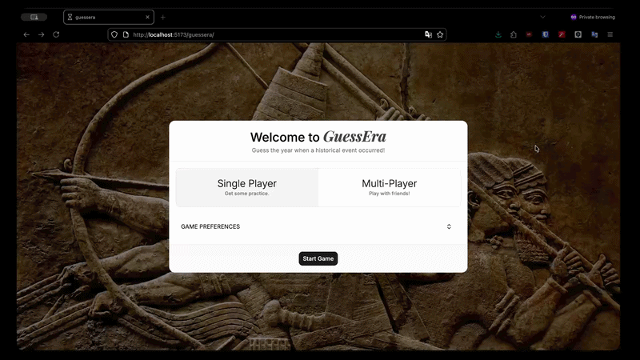
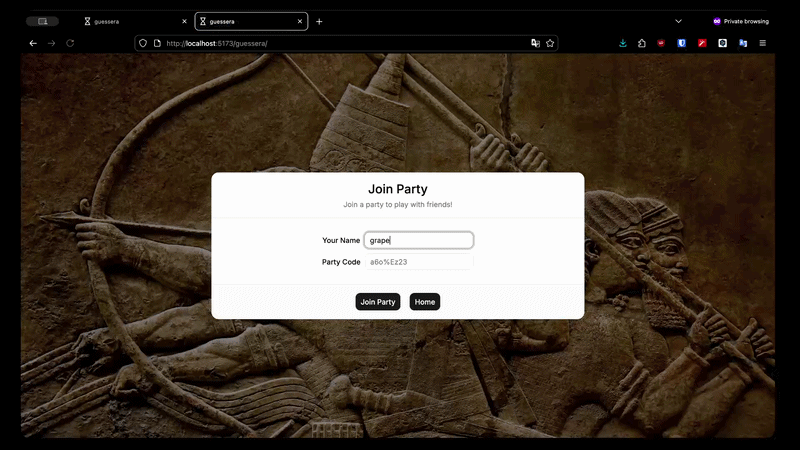
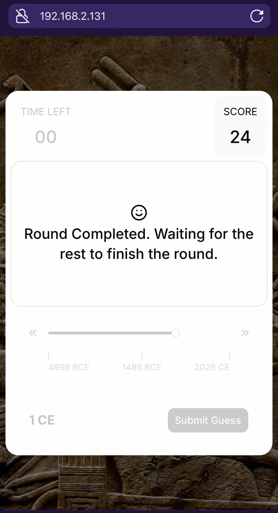
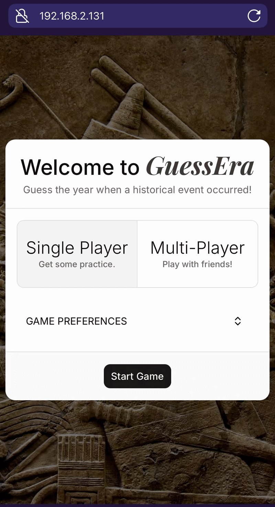
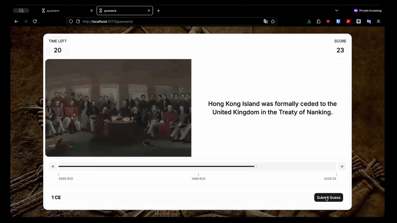
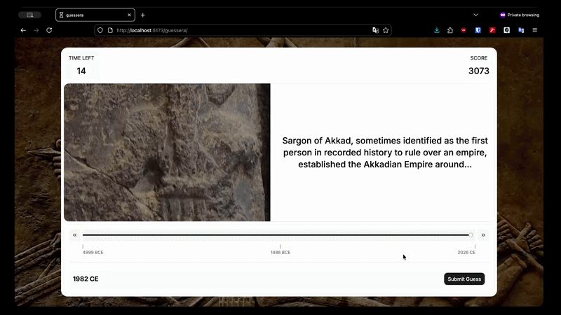

# GuessEra - A history game in which players try to guess the year of a historical event.

## Check out SinglePlayer Prototype on : [GitHub Pages](https://manishambre5.github.io/guessera/)

## Multiplayer Mode Preview

## Tech Stack

- React
- TypeScript
- Node.js
- Express
- Socket.IO
- TailwindCSS (ShadCn)